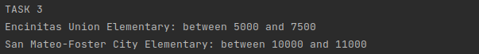

# Школа
___
**Вариант задания**

| объкт     | задание 1                                                                                                     | задание 2                                                                                                                                       | задание 3                                                                                                                                                                 |
|-----------|:--------------------------------------------------------------------------------------------------------------|-------------------------------------------------------------------------------------------------------------------------------------------------|---------------------------------------------------------------------------------------------------------------------------------------------------------------------------|
| **школа** | Постройка графика по среднему</br>количеству студентов в 10<br/> различных странах, взять на свой<br/> выбор | Выведите в консоль среднее<br/>количество расходов(expenditure) в<br/>Fresno, Contra Costa, El Dorado и <br/>Glenn, у которых прибыль больше 10 | Выведите в консоль учебное<br/>заведение, с количеством студентов<br/>равному от 5000 до 7500 и с 10000<br/>до 11000, с самым высоким<br/>показателем по математике(math) |

Для работы с SQLite создан класс **DbConnection** в методе **getConnection()** реализовано подключение к БД

```java
public Connection getConnection(){

        if(con==null){
        try {
        String host = "jdbc:sqlite:src/main/resources/school.db";
        Class.forName("org.sqlite.JDBC");
        con = DriverManager.getConnection( host );
        } catch (SQLException | ClassNotFoundException ex) {
        ex.printStackTrace();
        }
        }

        return con;
        }
```

Класс **DbWorker** создан для работы с БД, в нем реализованы методы:
- addWithCSV() - для заполнения БД с масива объектов из csv файла
- dropSchoolTable() - удаление таблицы school
- createSchoolTable() - создание таблицы school
- taskFirst() - получение 10 первых по алфовиту стран и их среднее коричество студентов 
- taskSecond(List<String> county, int income) - вывод в консоль среднее количество расходов</br>
по заданаму масиву стран и прибыль которых больше чем **income**
- thirdTask(int start, int end) - вывод в консоль учебное заведение с количеством студентов</br>
от **start** до **end** с самым высоким показателем по математики(math)
- stop() - закрытие поключения к БД

___
## Отчет
### Задание 1
Числовые данные, скриншот:</br>


Полученый график, из данных:</br>


### Задание 2
Создадим лист с названиями стран по заданию
```java
List<String> countysForTask2 = Arrays.asList("Fresno", "Contra Costa","El Dorado","Glenn");
```
И при запуске метода
```java
worker.taskSecond(countysForTask2, 10);
```
Получаем следующие данные:</br>


### Задание 3
Согласно заданию выполним два раза метод **thirdTask(int start, int end)**:
```java
worker.thirdTask(5000,  7500);
worker.thirdTask(10000,  11000);
```
В результате получем следующие данные:</br>
